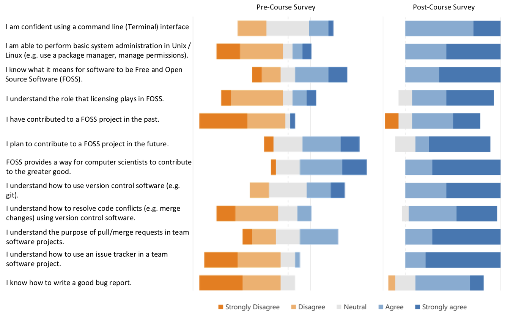
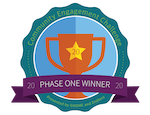
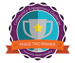

# Dickinson H/FOSS - Tools and Techniques for Software Development (COMP 190)

## Introduction:

Beginning in Fall 2016 Dickinson College began offering a year-long senior capstone course in which students engage with Free and Open Source Software (FOSS) projects and often those with  humanitarian objectives (i.e. HFOSS projects).  A [full report on this capstone](https://github.com/braughtg/DickinsonHFOSS-SFC-Materials) and its materials is also available. Based on our experiences with this senior capstone we significantly redesigned our curriculum beginning fall 2019 so that the knowledge, experiences and technical skill development necessary for H/FOSS participation occurs earlier and is distributed across a sequence of courses.

The first course in that sequence is __COMP 190 - Tools and Techniques for Software Development__,:

> An introduction to the Unix command line environment, shell scripting, system administration, debugging tools and version control. Skills developed will be applied in the context of a Humanitarian Free and Open Source Software (HFOSS) project. Case studies of social, legal and ethical issues raised by computing and computing for the greater good will complement the technical skill development.

The stated learning objectives for the course are:

> Students will:
  - gain proficiency with command line interaction with a Unix operating system including installation and configuration of software, shell scripting and basic system administration tasks.
  - gain proficiency with modern software development tools and their common uses including a debugger and a version control system.
  - deepen their understanding of social and ethical issues in computing and their appreciation of computing for the greater good.
  - [Writing in the Discipline (WiD) goal] develop their ability to produce clear, concise, technical writing for developers.

Our website contains the full details of the [Dickinson computer science curriculum](https://www.dickinson.edu/homepage/402/computer_science_curriculum) and highlights the H/FOSS course sequence (190/290/390/491/492) in the Tools & Practices area.

This repository will be a static snapshot and review of the materials for the COMP 190 course following its first offering in fall 2020. Please feel free to reach out if you are interested in most recent revisions of the materials.

## Course Context:

COMP 190 - Tools and Techniques for Software Development has been designed to be taken in the first semester of a student's second year. It is a required course for both computer science majors and minors, but is open to students from any major.  Prior to taking COMP 190, students will have completed two introductory computer science courses, typically with one being procedural (Python) and one being object oriented (Java). However, these prerequisites primarily serve to ensure maturity in the discipline rather than the specifics of any particular programming language or paradigm.

Dickinson counts courses rather than credit hours and COMP 190 counts as 1/2 course (equivalent to 2 credit hours). As such, the course would, under non-Pandemic conditions, meet for 75 minutes once per week for 14 weeks plus a three-hour final exam period each semester. To reach 1/2 course credit, there is also  a nominal expectation of 3 to 4 hours of work outside of class each week.

The semester in which this course was developed and first offered (fall 2020) was taught remotely due to the COVID-19 pandemic. This presented numerous challenges. The result was that there were 11 instead of 14 meetings, meetings were shortened to 10-20 minutes to adapt to asynchronous video delivery, and hands-on activities were designed as _workshop style_ guided explorations to be completed with asynchronous support.

While produced for use during a semester of remote instruction, the presentation slides and activities should be readily and effectively adaptable to in-person instruction. The same introductory presentation could be used, with the expanded 75-minute meeting times providing additional time for discussion, question and answer, opportunities to review past activities, exploration of enrichment topics and/or for students to begin work on the activities.  Development of materials for additional meetings, bringing the total to 14, will enable the course to more fully meet the stated learning objectives. The course is set to be offered again, in-person, in fall 2021.  Materials will be revised and expanded at that time. Some detail on the revisions and expansions are included in the Reflections & Improvements section below.

## Course Materials & Outline:

Logically the course is divided into three topics, each with individual course meetings and activities as outlined below. A brief description of each topic and the titles of each of its class meetings are provided.  For each class meeting the Power Point slide deck for the introduction and the activities assigned are linked below. All of the material can also be downloaded as [a single zip file](materials/COMP190Materials.zip).

For each meeting the introductory lecture is intended to be a _near minimal_ introduction to the content necessary to begin the activities. They try to provide context, convey the big ideas, essential vocabulary, and to clarify particularly troublesome details. The activities then both both review the key points of the lectures and guide students through good practices for independent learning of new material. The activities ask a variety of questions ranging from very direct facts that focus in on essential terms and ideas, to reporting results that confirm and reinforce hands-on steps, to more open questions that ask them to apply or reflect on the content of the activity.

#### A. Unix Introduction

Students use a virtual machine environment ([VirtualBox](https://www.virtualbox.org/)) to install a Linux operating system ([LinuxLite](https://www.linuxliteos.com/)). They then use this environment to develop facility with the command line interface, common gnu/linux tools and filters, simple shell scripting for task automation and performing basic system administration tasks such as installing software and managing users, groups and permissions.

1. __Operating Systems & Virtual Machines:__ [Slide Deck](materials/01-S-OSandVM.pptx) | [Activity Sheet](materials/01-A-OSandVM.docx)
1. __Shell Commands:__ [Slide Deck](materials/02-S-UnixAndShell.pptx) | [Activity Sheet](materials/02-A-UnixAndShell.docx)
1. __Command Line Tools and Filters:__ [Slide Deck](materials/03-S-UnixTools.pptx) | [Activity Sheet](materials/03-A-UnixTools.docx)
1. __Shell Scripting:__ [Slide Deck](materials/04-S-ShellScpriting.pptx) | [Activity Sheet](materials/04-A-ShellScpriting.docx)
1. __Basic System Administration:__ [Slide Deck](materials/05-S-SystemAdmin.pptx) | [Activity Sheet](materials/05-S-SystemAdmin.docx)

#### B. Free and Open Source Software

Students begin to explore FOSS ideas and techniques.  They look at the range of intellectual property rights (copyrights, trademarks, design rights, patents) and learn about Open Source licenses. They gain experience with the use of version control via git and GitHub (easily adapted to GitLab) and issue trackers in the context of FOSS projects. The traditional automake tools are used to build a FOSS project and provide practice resolving dependency issues. Finally, Docker is introduced as a mechanism for simplifying the setup of FOSS development environments.

6. __Intellectual Property, Sofware Licencing and FOSS:__ [Slide Deck](materials/06-S-LicensingFOSS.pptx) | [Activity Sheet](materials/06-A-LicensingFOSS.docx)
1. __Version Control & a Branching Workflow:__ [Slide Deck](materials/07-S-VersionControl.pptx) | [Activity Sheet](materials/07-A-VersionControl.docx)
   - The materials for this class require that the instructor fork the Calculator project in the [github_issues_activity-f18 repository](https://github.com/braughtg/github-issues-activity-f18) then clone the issues to the forked repository using a tool such as [github-issues-import](https://github.com/IQAndreas/github-issues-import).
1. __Version Control & Merge Conflicts:__ [Slide Deck](materials/08-S-MergeConflicts.pptx) | [Activity Sheet](materials/08-A-MergeConflicts.docx)
1. __Building a FOSS Project: _The gnu Autotools & Dependencies_:__ [Slide Deck](materials/09-S-BuildingAProject.pptx) | [Activity Sheet](materials/09-A-BuildingAProject.docx)
1. __Docker for FOSS Development:__ [Slide Deck](materials/10-S-Docker.pptx) | [Activity Sheet](materials/10-A-Docker.docx)

#### C. Humanitarian Free and Open Source Software Participation

Students explore the structure, licensing and documentation of a number of mature HFOSS projects. This provides a basis for assessing and suggesting improvements to our own [FarmData2 project](https://github.com/DickinsonCollege/FarmData2) project.  Students install FarmData2 and ultimately have several opportunities to contribute to FarmData2 through the confirmation/refinement/clarification of issues and by making pull requests that improve documentation. It is worth note that activities in this section would be relatively easy to adapt to other H/FOSS projects of interest at a particular institution.

11. __H/FOSS Communities and FarmData2:__ [Slide Deck](materials/11-S-FarmData2.pptx) | [Activity Sheet](materials/11-A-FarmData2.docx)
    - The latter parts of these activities are based on the state of the [FarmData2 project](https://github.com/DickinsonCollege/FarmData2) at the time of writing.  Thus, as FarmData2 continues to evolve some parts of this activity will become out of date (e.g. the installation process has been greatly simplified already).  Those parts will need to be updated and adapted as the FarmData2 project progresses.  

## Student Surveys & Analysis

Students were asked to complete a Likert-scale pre/post course survey to assess their attitudes towards H/FOSS and their perceptions of the knowledge that they gained in the course.  The questions asked in the survey were identical for the pre/post surveys. The questions on the survey and the breakdown of student agreement with each before and after the course are shown in Figure 1.  The [full survey](materials/COMP190PrePostSurvey.pdf) is also available as a pdf.

__Figure 1__: Pre/post course survey question and results.  Each bar represents 100% of student responses with the size of each color representing the fraction of students that expressed the indicated level of agreement. The pre-survey was completed by n=20 students and the post-survey was completed by n=14 students. Click the image for the full size version.

Overall this group of students moved fairly strongly toward increasing agreement on every question, suggesting that student perceive that they are achieving the learning goals set for the course. There were two questions on which there were students who disagreed in the post-course survey.  On the first, several students strongly disagreed that they had contributed to a FOSS project in the past. All students in the course made contributions to the FarmData2 project by commenting on issues and making a pull request for a documentation improvement. It is possible that students did not consider these actual contributions, did not consider FarmData2 to be a real FOSS project, or they may have interpreted this question as asking about prior to this course.  In the second, students agreed less strongly (as compared to other questions) that they knew how to write a good bug report. Students worked with issue trackers, read bug reports and had the opportunity to comment on them. However, instruction on this topic was implicit rather than explicit.  Thus, this result is consistent with the course materials used in this offering and is something that will be addressed in the future.

## Reflections & Content Improvements

The materials in this repository reflect the first offering of this course. As with any course, not to mention one created in such unusual circumstances, there is room for revision and improvement in future offerings.  Some overall reflections on the course and materials a whole as well as a few key content areas to be improved in the next offering are outlined below.

#### Reflections

- Students engaged with the materials and in individual discussions reported learning a lot.  Of particular note, this was true both of students who had limited exposure to Linux and the command line, as well as those who were more experienced. One student in particular, who had "taught himself Linux," and setup his own web server, frequently mentioned how he was still learning new things.  Thus, the course seems pitched at a good level both for those without prior Linux and command line experience and those that have built up some experience on their own.

- Overall the activity sheets would benefit from a more intentional structure and progression of questions. The concepts of _directed_, _convergent_ and _divergent_ questions from the POGIL methodology may provide a useful framework for this revision.  Some more specific thoughts on this include:
  - Many of the activities guide students through a series of steps that model typical usage patterns or workflows. These activities give each student a concrete experience with the related skill or concept. The questions associated with these activities are often of the form "what command did you use?" or "what output was generated?"  While providing these answers ensures that each student has had the desired concrete experience, I worry they may feel didactic. Such experiences are an essential first step for most students in internalizing and generalizing the skills and concepts.  Making the intention of these questions explicit to students by clearly distinguishing them in some way from questions that require more thought, reflection and understanding will be one way this concern will be addressed in the next offering.
  - While there are reflective questions that require the generalization or synthesis of the skills and concepts, my sense is that they should be more frequent and more systematic. The approach in the prior point of clearly distinguishing different types of questions will be useful in being more intentional about including questions that require a greater depth of understanding.
  - The activities have a mix of narrative, steps to be taken and questions to be answered.  Some steps require answers, others do not. This mixture resulted in some students occasionally missing places where questions required an answer. Adding answer boxes to the activity sheets is a simple way that this will be addressed in the future. This will have the added benefit of simplifying grading by clearly delineating the student responses from the narrative of the activity sheets. Related to the prior two points, the styling of the answer boxes can be used to indicate the type of each question.

- The FarmData2 project and HFOSS did not play as central a role in the course as was originally hoped.  This in part was due to constraints on course development time and in part due to the relative immature state of FarmData2.  Over future iterations of the course both HFOSS and the FarmData2 project will become a more fully integrated part of the course from the start.  For example, if the installation of FarmData2 becomes simple enough, it could be done early on in the course and then activities such as the command line tools, shell scripting and version control could be applied, if not introduced, in the context of FarmData2.

#### Content Improvement

- The introduction of regular expressions in Activity 03 seemed insufficient and should be reconsidered. The idea of regular expressions, at least simple matching patterns, are an important topic.  Focusing this part on a few key usage patterns (e.g. wildcards, start or end of line matching, etc) should help reduce the scope and improve student grasp of the essentials.

- The coverage of intellectual property in Activity 06 was adequate but could be improved.  There was no resource that covered the key IP areas (patents, copyright, trademark, design rights) at a depth that was consistent across areas and at an appropriate depth. Ideally and introduction to all of these areas clearly delineating their purpose, requirements and limits would be the starting point can be found or pieced together.  If not one could be produced. This would then, as it is now, be the stepping off point for covering copyright and its relationship to FOSS licensing in greater depth.

- Options for moving Activities 07 and 08 (on version control, the branching workflow and merge conflicts) into a frozen version of a real project should be explored. It will be essential to keep the cognitive load of the code changes to a minimum to allow the focus to be on the version control. Perhaps small changes to wording or interface colors or fonts might be a good target.  Additionally, approaches for automating the merging pull requests and the introduction of merge conflicts should be explored.  For example, [GitHub Actions](https://github.com/features/actions) should provide all of the necessary capabilities.

- A mature HFOSS project should be identified for use in Activities 09 and 10 on build tools and docker. These currently use the [FreeCiv](http://www.freeciv.org/) game.  This was a choice of efficiency as prior activities had already been developed for this project based on its use in the book [Practical Open Source Software Exploration: How to be Productively Lost, the Open Source Way](https://quaid.fedorapeople.org/TOS/Practical_Open_Source_Software_Exploration/html/index.html) by Greg DeKoenigsberg, Chris Tyler, Karsten Wade, Max Spevack, Mel Chua and Jeff Sheltren. Projects in the [GNOME GitLab](https://gitlab.gnome.org/GNOME) seem like good targets for this as many of them use the traditional build tools and require dependencies to be installed.  Admittedly, as projects move to container based distributions and development environments this will become less and less of a concern.

- It is an open question for consideration whether the creation of container images (e.g. writing Docker and Docker-Compose files) should be included.  From the perspective of joining a FOSS project this is unlikely to be necessary. But from the perspective of creating a FOSS project it is increasingly essential. I would expect that an additional activity following Activity 10 could cover the most elementary examples of Docker and docker-compose files sufficiently to provide an understanding of the fundamental concepts involved.  Alternatively, Activity 10 and this new one could be restructured if it yields a more effective presentation.  For example, it may make sense to introduce writing docker-compose files to combine existing images into an application first, with Docker files being introduced second as a way to customize existing images.

- Due to time constraints an activity focusing on debugger use was not developed in the first offering.  Ideally, this would come after Activities 09 and 10 and make use of the same HFOSS project.  This will be greatly simplified by including a browser based IDE and debugging solution in the containerized development environment in the prior activities.

- Activity 11 should be expanded into two activities and an open-ended finals-week assignment.  The first would, as it begins now, focus on understanding mature HFOSS communities and an introduction to the FarmData2 community.  This would include conducting critical reviews of essential documentation, doing an installation, and making contributions to documentation.  The second activity, would focus on working within the issue tracker, verifying and clarifying issues and would include explicit instruction on high quality writing for issues (to satisfy the WiD goal as mentioned earlier).  A finals-week project would then provide opportunities for self-selected contributions to the project through a variety of avenues (documentation, issues, code, etc...).

---
## Acknowledgements:

Partial support for the development of these materials has been provided by:
  - A grant from [foss2serve](http://foss2serve.org/index.php/Main_Page) through the [Software Freedom Conservancy](https://sfconservancy.org/) (July 2020-September 2020).
  - The National Science Foundation ([DUE-2013069](https://www.nsf.gov/awardsearch/showAward?AWD_ID=2013069)) - Collaborative Research: Broadening Participation in Computing through Authentic, Collaborative Engagement with Computing for the Greater Good.
  - The GNOME Community Engagement Challenge:
    -  

I want to thank the following individuals for their unique contributions to this project:
  - Tim Wahls, good friend and computer science faculty at Dickinson, who led the development of the original FarmData and AnimalData projects.
  - Matt Steiman, farmer at the Dickinson Farm, it is his collaboration with Tim that made FarmData/AnimalData possible. It is his patience and generosity with his time that are now making FarmData2 possible.
  - Mike Stenta and the team at [Farm OS](https://farmos.org/), on which FarmData2 is built, for their awesome platform and the open, helpful and welcoming community that they have built around it.
  - Allen Tucker at [The Non-Profit FOSS Institute](https://npfi.org) for his early work porting FarmData/AnimalData to FarmOS and his continuing contributions to both FarmData2 and to HFOSS in education more braodly.
  - Michael Skalak, computer science faculty at Dickinson, who's work in understanding the FarmOS system and continuous work on FarmData2 is essential to its success.
  - Stony Jackson & Heidi Ellis at Western New England College and Karl Wurst at Worcester State University for their insights and advice in getting the FarmData2 project off the ground.
  - All of the students that took COMP 190 at Dickinson College with me in fall 2020. Their thoughtful feedback on the course activities and their contributions to FarmData2 will make both better the next time around!

Finally, I want to mention some of the outstanding resources that either directly or indirectly informed the activities and materials created for this course:
  - [Ryan's Tutorials](https://ryanstutorials.net/) are an excellent resource for learning Linux and command line tools and are used heavily in Activities 02, 03 and 04.
  - Producing Open Source Software: How to Run a Successful Free Software Project](https://producingoss.com/en/index.html) by Karl Fogel.
  - [Practical Open Source Software Exploration: How to be Productively Lost, the Open Source Way](https://quaid.fedorapeople.org/TOS/Practical_Open_Source_Software_Exploration/html/index.html) by Greg DeKoenigsberg, Chris Tyler, Karsten Wade, Max Spevack, Mel Chua and Jeff Sheltren.
  - [Learning Activities page on foss2serve](http://foss2serve.org/index.php/Category:Learning_Activity). Many of the materials on this site were adopted, adapted or provided the inspiration in the creation of this course.

---
#### Licensing:

###### All textual materials provided in this repository are licensed under a [Creative Commons Attribution-NonCommercial-ShareAlike 4.0 International License](http://creativecommons.org/licenses/by-nc/4.0/)
